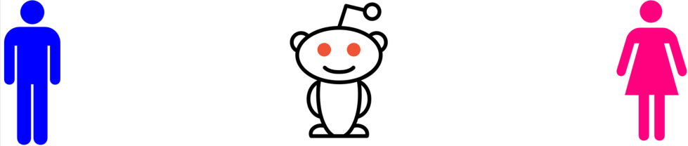

# 
## Gender Recognition with NLP
Partially inspired by the Electronic Frontier Foundation's Panopticlick project, this project is an exploration into what it takes to identify attributes in people who are otherwise on anonymous platforms.  

I used the tried an true bag-of-words technique from NLP for features which I fed to SVM, SGDClassifier, and Niave Bayes algorthims.

### Dependencies
* nltk
* TextBlob
* scikit-learn
* numpy
* pandas
* PRAW: Python Reddit Api Wrapper

### Results
Niave Bayes performed the best of the three algorthims used with a resulting 70% accuracy. Given more time, I would have liked to try to use n-grams instead of bag-of-words alone along with with an attempt to engineer some features from the meta data.
